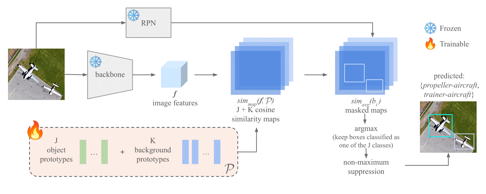

# Exploring Robust Features for Few-Shot Object Detection in Satellite Imagery

[Xavier Bou](https://www.linkedin.com/in/xavier-bou-hernandez-39b517134/), [Rafael Grompone](https://scholar.google.fr/citations?user=GLovf4UAAAAJ&hl=en), [Thibaud Ehret](https://tehret.github.io), [Gabriele Facciolo](http://gfacciol.github.io/), [Jean-Michel Morel](https://sites.google.com/site/jeanmichelmorelcmlaenscachan/)

Centre Borelli, ENS Paris-Saclay

---

[]()
[](https://drive.google.com/drive/folders/1g3JhJivPlmpCfggAAJoiZPJDOIBeJR5J?usp=sharing)
[]()

This repository is the official implementation of the paper [Exploring Robust Features for Few-Shot Object Detection in Satellite Imagery](https://arxiv.org/abs/2403.05381).

🎉 **Our Paper Has Been Accepted to EarthVision Workshop at CVPR24!** 🌍

The goal of this paper is to perform object detection in satellite imagery with only a few examples, thus enabling users to specify any object class with minimal annotation. To this end, we explore recent methods and ideas from open-vocabulary detection for the remote sensing domain. We develop a few-shot object detector based on a traditional two-stage architecture, where the classification block is replaced by a prototype-based classifier. A large-scale pre-trained model is used to build class-reference embeddings or prototypes, which are compared to region proposal contents for label prediction. In addition, we propose to fine-tune prototypes on available training images to boost performance and learn differences between similar classes, such as aircraft types. We perform extensive evaluations on two remote sensing datasets containing challenging and rare objects. Moreover, we study the performance of both visual and image-text features, namely DINOv2 and CLIP, including two CLIP models specifically tailored for remote sensing applications. Results indicate that visual features are largely superior to vision-language models, as the latter lack the necessary domain-specific vocabulary. Lastly, the developed detector outperforms fully supervised and few-shot methods evaluated on the SIMD and DIOR datasets, despite minimal training parameters.


## Contents

1. [Overview](#Overview)
1. [Requirements](#Requirements)
1. [Data preparation](#Data-preparation)
1. [Create prototypes](#Create-prototypes)
1. [Fine-tune prototypes](#Fine-tune-prototypes)
1. [Evaluate](#Evaluate)
1. [Citation](#Citation)
1. [License and Acknowledgement](#License-and-Acknowledgement)

### Overview


Detect your desired objects in optical remote sensing data via a few simple steps:
1. Prepare the data with N labelled examples per category (we provide examples for N={5, 10, 30})
1. Create class-reference prototypes and background prototypes
1. Fine-tune class-reference embeddings
1. Detect objects via RPN and the learned embeddings!

### Requirements:
Create a conda environment and install the required packages as follows. You might need to adapt versions of packages depending on your hardware:
```Shell
  conda create -n ovdsat python=3.9 -y
  conda activate ovdsat
  pip install torch==1.13.0+cu116 torchvision==0.14.0+cu116 torchaudio==0.13.0 --extra-index-url https://download.pytorch.org/whl/cu116
  python -m pip install 'git+https://github.com/facebookresearch/detectron2.git'
  pip install opencv-python albumentations transformers
```

### Data preparation
To set up the data and pre-trained weights, download the contents of the following [Google Drive folder](https://drive.google.com/drive/folders/1g3JhJivPlmpCfggAAJoiZPJDOIBeJR5J?usp=sharing). We provide the same splits and labels we use in our article for the SIMD dataset (N = {5, 10, 30}). Add the data/ and weights/ directories into the project directory.

### Create prototypes
To generate the class-reference and background prototypes using [DINOv2](https://github.com/facebookresearch/dinov2) features, run the following command:
```Shell
bash scripts/create_prototypes_simd.sh
```
If you are running other data or the files/paths differ from ours, you can adapt the contents of the bash file to your own structure.

### Fine-tune prototypes
Train the pre-initialised class-reference prototypes on the available data:
```Shell
bash scripts/train_simd.sh
```

### Evaluate
Evaluate the learned prototypes on unsen data:
```Shell
bash scripts/eval_simd.sh
```

### Citation
If you found our work useful, please cite it as follows:
```bibtex
@article{Author:Year,
  title={Exploring Robust Features for Few-Shot Object Detection in Satellite Imagery},
  author={Bou, Xavier and Facciolo, Gabriele and von Gioi, Rafael Grompone and Morel, Jean-Michel and Ehret, Thibaud},
  journal={arXiv preprint arXiv:2403.05381},
  year={2024}
}
```

### License and Acknowledgement

This project is released under the GPL-3.0 license.
